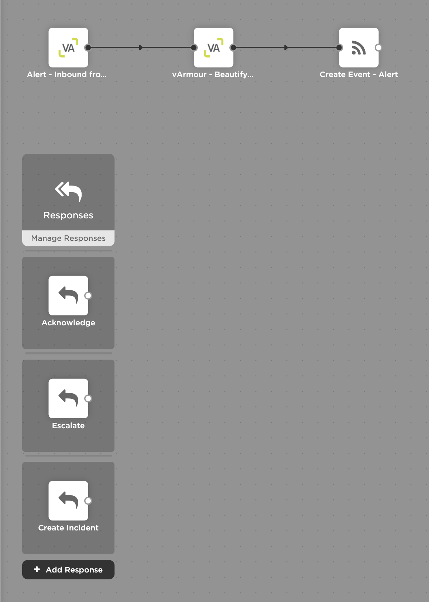

# vArmour

This integration allows you to alert people in xMatters when getting an alert from vArmour.

---------

<kbd>

</kbd>

---------

# Files

* [vArmour.zip](vArmour.zip) - Workflow zip file with the step and example flow
* [vArmour.png](/vArmour.png) - vArmour logo

# Installation

## xMatters Setup
1. Download the [vArmour.zip](vArmour.zip) file onto your local computer
2. Navigate to the Workflows tab of your xMatters instance
3. Click Import, and select the zip file you just downloaded
4. Go into the Workflow **Alert**
5. Copy the URL in the **Alert - Inbound from vArmour** step. This will be used when setting up vArmour.
6. Connect steps to different responses in the Flow (such as adding a ServiceNow Create Incident after the Create Incident response).

## vArmour Setup
Put the URL from the **Alert - Inbound from vArmour** step into vArmour.

# Flow
This is what the flow looks like in xMatters.

<kbd>

</kbd>
