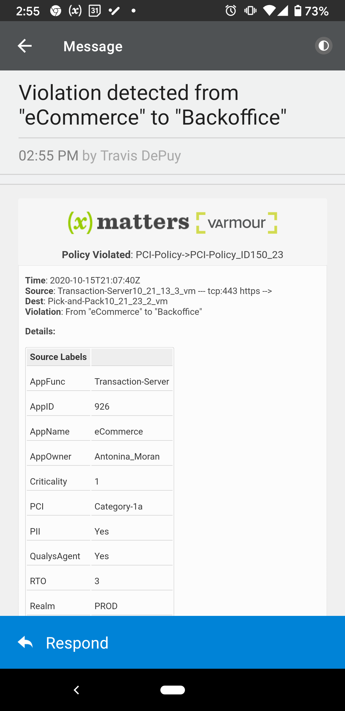
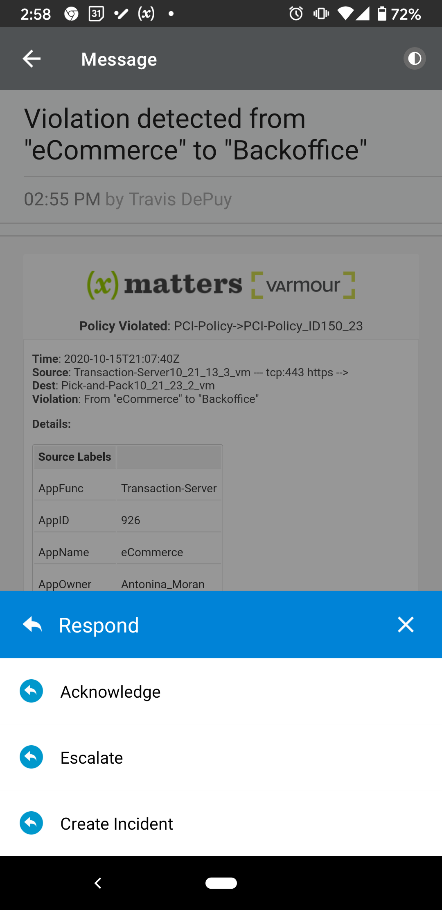

# vArmour

This integration to vArmour adds critical notifications using on-call scheduling and process automation. 


---------

<kbd>
<a href="https://support.xmatters.com/hc/en-us/community/topics">
   
</a>
</kbd>

---------

# Files

* [vArmour.zip](vArmour.zip) - Workflow zip file with the step and example flow

# How It Works

When policy violation occurs, a payload is sent to xMatters with a list of the affected applications. The `AppOwner`s of the source and destination apps are targeted, but [subscriptions](https://help.xmatters.com/ondemand/userguide/receivingalerts/subscriptions/sharingsubscriptions.htm) can be put in place to notify other groups and users as appropriate. 

Responding with **Acknowledge** will stop the user and device escalations. **Escalate** will immediately escalate to the next user (if a group was targeted) and **Create Incident** will stop escalations and create an Incident in xMatters.

Screen shots of the mobile notifications

<kbd></kbd>  <kbd></kbd>


# Installation

## Create a User

1. Create a new user for vArmour to use to authenticate. Navigate to the Users menu and click **Add Users**. 
2. Enter the appropriate details and make sure to grant the **REST Web Service User** role. 

## xMatters Setup
1. Download the [vArmour.zip](vArmour.zip) file onto your local computer
2. Navigate to the Workflows tab of your xMatters instance
3. Click Import, and select the zip file you just downloaded
4. Open the workflow and on the Forms tab, click the **Web Service** drop down and select **Sender Permissions**. Enter the vArmour username added above. Click Save Changes. 
5. On the Flows tab, click the **Alert** link to display the canvas. Double click the **Alert - Inbound from vArmour** HTTP Trigger step and copy the url.

## vArmour Setup

Contact vArmour support and have them configure the instance to trigger a webhook to the url you copied from the **Alert - Inbound from vArmour** HTTP Trigger.

# Testing

In vArmour trigger a policy violation that will fire the webhook to xMatters. An event will be created targeting the `dgroups.wlabels.AppOwner` and `sgroups.wlabels.AppOwner` from the payload sent from vArmour. If no notification was received, check the [Activity Stream](https://help.xmatters.com/ondemand/xmodwelcome/integrationbuilder/activity-stream.htm) to verify the webhook was received. Inspect for any errors. If the webhook was not received, contact vArmour support for further investigation.


# Troubleshooting


This is an example payload:

```
{
   "app": "https",
   "count": 77,
   "dgroups": {
      "labels": ["PCI=Category-3"],
      "wlabels": {
         "AppFunc": "Pick-and-Pack",
         "AppID": "23422",
         "AppName": "Backoffice",
         "AppOwner": "Rueben_Mckenzie",
         "Criticality": "3",
         "PCI": "Category-3",
         "PII": "No",
         "QualysAgent": "Yes",
         "RTO": "1",
         "Realm": "PROD",
         "Region": "AWS-US-West",
         "System": "Internal",
         "TaniumAgent": "Yes"
      }
   },
   "dip": "Pick-and-Pack10_21_23_2_vm",
   "dst_ip": "10.21.23.2",
   "end_time": "2020-10-15T21:36:55Z",
   "matching_policy": {
      "matched_chain": "PCI-Policy",
      "matched_rule": "PCI-Policy_ID150_23"
   },
   "service": "tcp:443",
   "sgroups": {
      "labels": ["PCI=Category-1a"],
      "wlabels": {
         "AppFunc": "Transaction-Server",
         "AppID": "926",
         "AppName": "eCommerce",
         "AppOwner": "Antonina_Moran",
         "Criticality": "1",
         "PCI": "Category-1a",
         "PII": "Yes",
         "QualysAgent": "Yes",
         "RTO": "3",
         "Realm": "PROD",
         "Region": "AWS-US-West",
         "System": "Internal",
         "TaniumAgent": "Yes"
      }
   },
   "sip": "Transaction-Server10_21_13_3_vm",
   "src_ip": "10.21.13.3",
   "start_time": "2020-10-15T21:07:40Z"
}
```